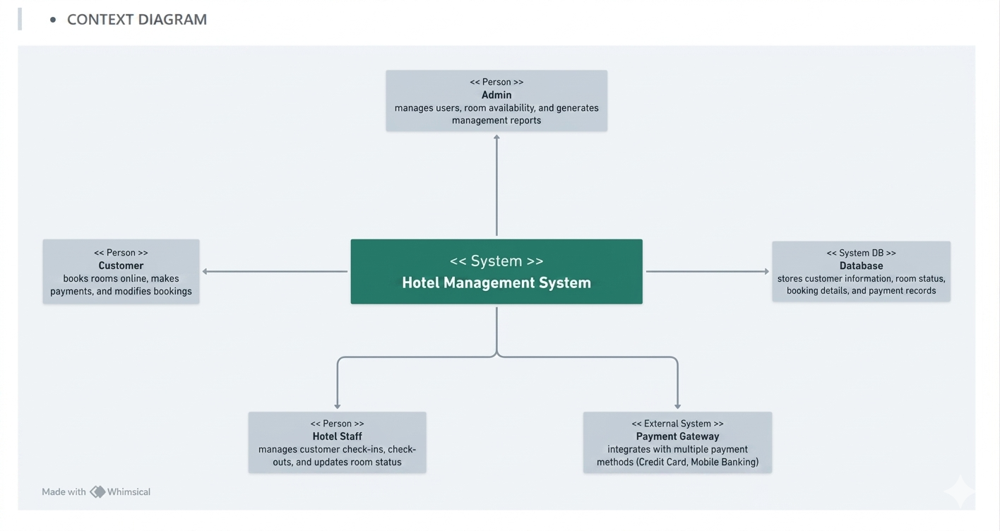

# Software Requirements Specification (SRS)

## Hotel Management System

---

# 1. Introduction

## 1.1 Purpose

The purpose of this project is to develop a Hotel Management System that automates hotel operations such as room booking, customer management, payment processing, check-in/check-out, and report generation.

The system helps hotel staff manage daily activities efficiently and provides customers with an easy booking experience.

---

## 1.2 Scope

The Hotel Management System will:

* Allow customers to book rooms online
* Manage room availability
* Store customer information
* Process payments
* Handle check-in and check-out
* Generate reports for management

The system will be used by:

* Customers
* Hotel Staff
* Hotel Administrator

---

## 1.3 Definitions

| Term      | Description                |
| --------- | -------------------------- |
| Admin     | System administrator       |
| Customer  | Person booking a room      |
| Booking   | Room reservation           |
| Check-In  | Customer arrival process   |
| Check-Out | Customer departure process |

---

# 2. Overall Description

## 2.1 Product Perspective

The Hotel Management System is a web-based application connected to a centralized database.

---

## 2.2 Product Functions

The system shall:

* Register users
* Login users
* Display room information
* Book rooms
* Cancel bookings
* Process payments
* Generate invoices
* Generate reports
* Manage room status

---

## 2.3 User Classes and Characteristics

| User Type | Description                |
| --------- | -------------------------- |
| Customer  | Searches and books rooms   |
| Staff     | Handles check-in/check-out |
| Admin     | Manages entire system      |

---

## 2.4 Operating Environment

* Operating System: Windows/Linux
* Frontend: HTML, CSS, JavaScript
* Backend: PHP / Java / Python
* Database: MySQL

---

# 3. Functional Requirements

## 3.1 User Registration

### Description

The system shall allow customers to create accounts.

### Inputs

* Name
* Email
* Phone Number
* Password

### Output

* Registration Success Message

---

## 3.2 User Login

### Description

Users can log into the system using email and password.

---

## 3.3 Room Management

### Description

Admin can:

* Add rooms
* Update room details
* Delete rooms
* Change room status

---

## 3.4 Room Booking

### Description

Customers can:

* Search available rooms
* Select room type
* Book room

### Inputs

* Check-in Date
* Check-out Date
* Room Type

### Outputs

* Booking Confirmation

---

## 3.5 Payment Management

### Description

The system shall process online/offline payments.

### Payment Methods

* Cash
* Credit Card
* Mobile Banking

---

## 3.6 Check-In and Check-Out

### Description

Staff can manage customer arrival and departure.

---

## 3.7 Report Generation

### Description

Admin can generate:

* Booking reports
* Revenue reports
* Customer reports

---

# 4. Non-Functional Requirements

## 4.1 Performance Requirements

* System response time should be less than 3 seconds.
* System should support multiple users simultaneously.

---

## 4.2 Security Requirements

* Password encryption
* Secure payment processing
* User authentication

---

## 4.3 Reliability Requirements

* Database backup support
* Error handling mechanism

---

## 4.4 Usability Requirements

* Easy-to-use interface
* Responsive design

---

# 5. System Models

## Context Dagram
```

---

# 6. Database Design

## 6.1 Customer Table

| Field       | Type    |
| ----------- | ------- |
| customer_id | INT     |
| name        | VARCHAR |
| email       | VARCHAR |
| phone       | VARCHAR |

---

## 6.2 Room Table

| Field       | Type    |
| ----------- | ------- |
| room_id     | INT     |
| room_number | VARCHAR |
| room_type   | VARCHAR |
| price       | DECIMAL |
| status      | VARCHAR |

---

## 6.3 Booking Table

| Field       | Type |
| ----------- | ---- |
| booking_id  | INT  |
| customer_id | INT  |
| room_id     | INT  |
| check_in    | DATE |
| check_out   | DATE |

---

## 6.4 Payment Table

| Field          | Type    |
| -------------- | ------- |
| payment_id     | INT     |
| booking_id     | INT     |
| amount         | DECIMAL |
| payment_method | VARCHAR |

---

# 7. Constraints

* Internet connection required
* Secure database access required
* Payment gateway integration required

---

# 8. Assumptions and Dependencies

* Users have internet access
* Hotel staff are trained to use the system
* Payment services are available

---

# 9. Future Enhancements

* Mobile Application
* Online Reviews
* SMS Notifications
* AI-based Room Recommendation
* Multi-language Support

---

# 10. Conclusion

The Hotel Management System will improve hotel operations by automating booking, payment, customer management, and reporting processes. It reduces manual work, improves efficiency, and enhances customer satisfaction.
